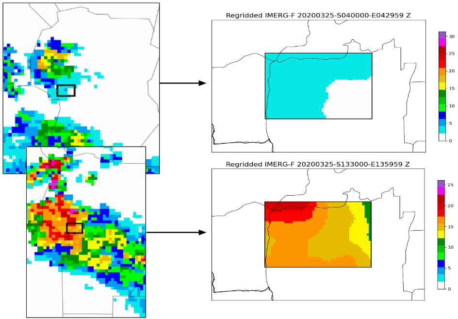

# imerg2wrfhydro

Scripts for regridding IMERG precipitation to the WRF-Hydro domain (regridding.py).
This script uses inverse distance interpolation. A precipitation value is calculated for each WRF-Hydro grid point using the 4 nearest IMERG grid points.
Files required:
1) IMERG files in netcdf format
2) geogrid file (this file contains the WRF-Hydro domain information)

Usage example:
python regridding.py './path/to/imerg/files/*.nc4' '/path/to/geofile/geo_em.d01.nc' './output_dir'

This script allows you to:
1) Plot the regridded precipitation (set plot_regridded = True)
2) Plot IMERG precipitation (only for Argentina) (set plot_imerg = True)
3) Debug option (set debug = True)

Don't forget to include a shape file for better reference, this will be optional in future versions.

Note: This repository contains an .ipynb to download the IMERG precipitation from the GES DISC website (https://disc.gsfc.nasa.gov/).
